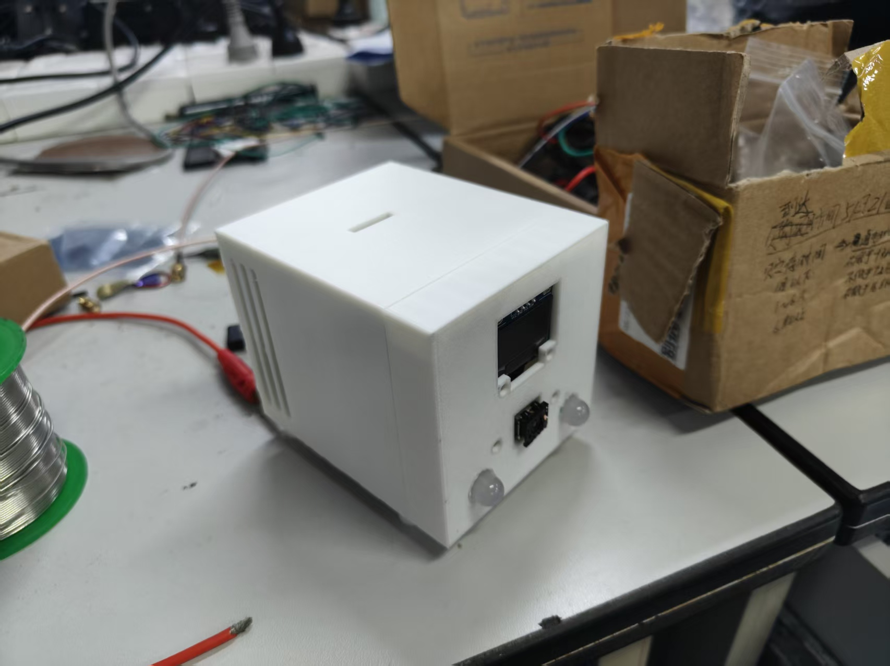
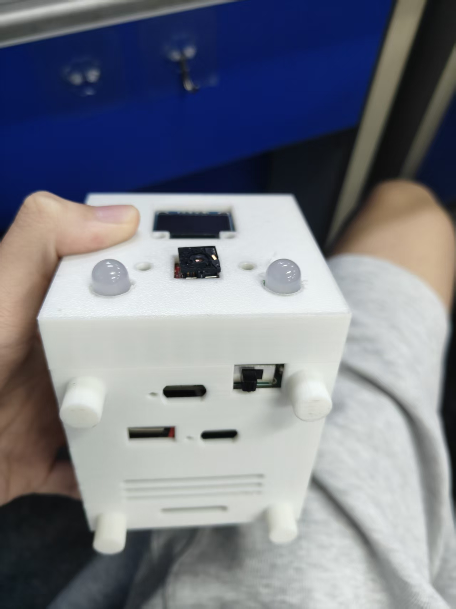
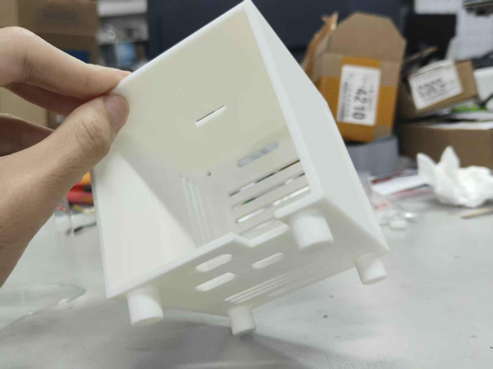
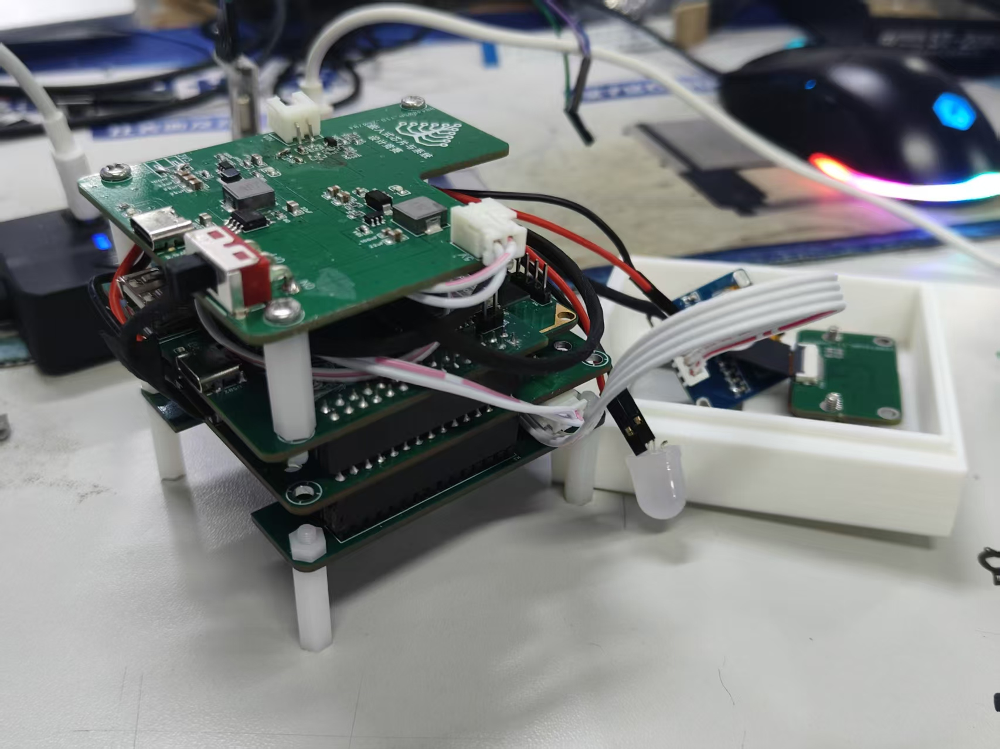
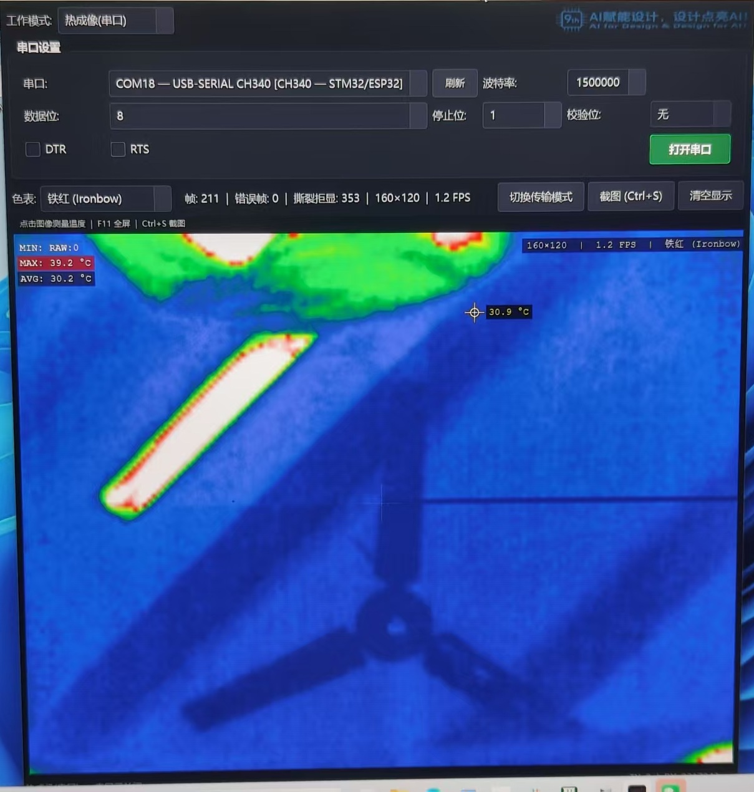
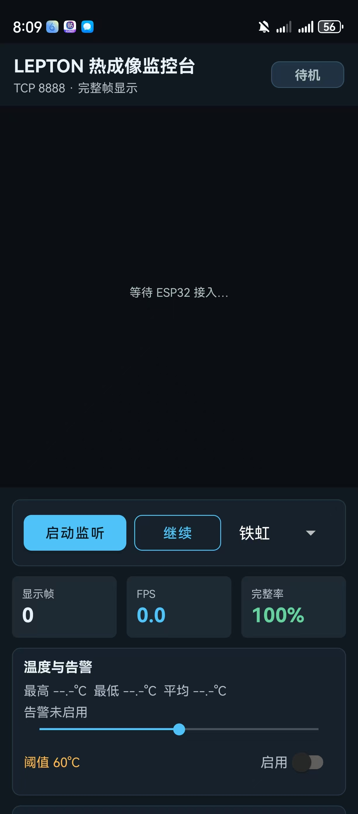

# XIH6 — 基于 FLIR Lepton 3.5 的热成像监控系统

[](https://www.st.com/en/microcontrollers-microprocessors/stm32h743xi.html)
[](https://www.flir.com/products/lepton/)
[](https://www.espressif.com/)
[](https://www.qt.io/)
[](https://developer.android.com/)
[](#license)

## **在这里着重感谢帮我设计外壳和供电板的外援，虽然没怎么用上，但是很好看😋**

一套从零自制的红外热成像监控系统：**FLIR Lepton 3.5 → STM32H743 → { USB 串口 | ESP32-S3 WiFi } → Qt 桌面端 / Android 手机端**，附带温湿度、烟雾、空气质量传感与火灾声光告警。

两周时间、一个人(**代码和核心功能PCB设计**)、从画板到出图。2026 年全国大学生嵌入式芯片与系统设计竞赛参赛作品——最终因时间不足未能完成全部验证，遗憾离场，但链路上每一帧都是真实的。

系统的核心信条只有一条：

> **帧完整性 > 视觉连续性 > 延迟 > 帧率。**
> 宁可 1.2 FPS 的完整画面，绝不显示一帧撕裂的图像。

---

## 1. 成品展示

### 整机

正面为 LEPTON 镜头窗、0.96" OLED 状态屏与乳白扩散罩告警灯；侧面引出双 Type-C（供电/串口）、microSD 卡槽与电源开关；底部开散热格栅。

| 正面 | 顶面布局 |
|:---:|:---:|
|  |  |
| OLED 屏 + LEPTON 镜头窗 + 告警灯 | 顶面：OLED / LEPTON / 双告警灯球；侧面：Type-C ×2、SD 卡槽、电源开关 |

### 外壳与内部

| 3D 打印外壳 | 内部板级堆叠（调试期） |
|:---:|:---:|
|  |  |
| 自绘自印，开孔对位 OLED/镜头/告警灯/接口 | 电源板 + 核心板 + 传感器板三层堆叠，尼龙柱支撑；右侧外壳内已装 OLED 与传感器模块 |

---

## 2. 实测效果

### Qt 桌面端（USB 串口直连，1.5 Mbps）



状态栏就是这套系统的成绩单：**帧 211 · 错误帧 0 · 撕裂拒显 353 · 160×120 · 1.2 FPS**。

- "撕裂拒显 353"意味着上位机检测到 353 个不完整/校验失败的帧段并**全部拒绝上屏**——这正是"完整帧门禁"在工作：错误帧显示数为 0，画面永远干净；
- 铁红（Ironbow）色表 + 百分位自动拉伸；
- 点击画面任意位置实时测温（图中 30.9 °C），左上角同步显示全帧 MIN / MAX / AVG 温度——LEPTON 3.5 的 TLinear 辐射测温输出，每个像素都是绝对温度。

### Android 手机端（ESP32-S3 WiFi TCP）

<p align="center"></p>

手机作为 TCP 服务器监听 8888 端口，ESP32-S3 桥主动拨入推流。界面提供：色表切换（铁虹等）、显示帧数 / FPS / **帧完整率**统计、全帧温度概览（最高/最低/平均）、可调阈值的超温告警开关。协议与 Qt 端完全一致——STM32 打出的同一帧，两端都能解。

---

## 3. 系统架构

```text
                 ┌────────────────────── 传感与告警 ──────────────────────┐
                 │  SHT40 温湿度   MQ-2 烟雾   MQ-135 空气质量             │
                 │  0.96" OLED    microSD    告警灯(PJ15)   蜂鸣器(PG9)   │
                 └──────────────────────────┬─────────────────────────────┘
                                            │ 协作时间轮（背景任务分片调度）
  ┌──────────────┐   VoSPI (SPI4)   ┌───────┴───────┐
  │ FLIR LEPTON  │ ───────────────► │  STM32H743XIH6 │   视频路径每轮无条件最先执行
  │     3.5      │   MCLK 24MHz     │  裸机超级循环   │
  │  160×120     │   (TIM1 PWM)     └───┬───────┬───┘
  └──────────────┘                      │       │
                          UART4 1.5Mbps │       │ SPI5 从机 + DRDY 握手
                          (CH340C USB)  │       │ (运行时热切换)
                                        ▼       ▼
                                  ┌─────────┐ ┌──────────┐
                                  │ Qt 桌面端│ │ ESP32-S3 │
                                  │ 串口模式 │ │  WiFi 桥 │
                                  └─────────┘ └────┬─────┘
                                                   │ TCP :8888
                                        ┌──────────┴──────────┐
                                        ▼                     ▼
                                  ┌──────────┐         ┌───────────┐
                                  │ Qt 桌面端 │         │  Android  │
                                  │ WiFi 模式 │         │  监控台   │
                                  └──────────┘         └───────────┘
```

**双链路热切换**：上电默认走 UART4/CH340C 串口；串口发送 `T`/`U`/`W`（或 `MODE_TOGGLE` 等命令行）即可在运行时切到 SPI5→ESP32→TCP 链路，切换在帧边界执行，绝不切断半帧。

**帧数据流水线**（STM32 内部）：

```text
VoSPI 包解析 → segment 校验/去重 → 装配暂存区（staging）
    → 4 个 segment 齐活才发布到 lepton_raw_frame（不完整帧永不出门）
    → AA55 打包 + 校验和 → 乒乓缓冲 → TX DMA（UART4 或 SPI5）
    → 上一帧还在线上？直接丢弃本帧，绝不阻塞采集
```

---

## 4. 通信协议（AA55 二进制帧）

一帧固定 **38415 字节**，Qt 与 Android 共用同一解析器逻辑：

| 偏移 | 长度 | 字段 | 说明 |
|---:|---:|---|---|
| 0 | 2 | `0xAA 0x55` | 同步头 |
| 2 | 1 | `0x01` | 帧类型：RAW16 热像 |
| 3 | 2 | Frame ID | u16 BE，滚动计数，用于丢帧统计 |
| 5 | 2 | Width | u16 BE，= 160 |
| 7 | 2 | Height | u16 BE，= 120 |
| 9 | 4 | Payload Length | u32 BE，= 38400 |
| 13 | 38400 | 像素数据 | 每像素 u16 BE，TLinear centikelvin |
| 38413 | 2 | Checksum | u16 BE，同步头至载荷逐字节求和 |

**温度换算**：`T(°C) = raw × 0.01 − 273.15`（LEPTON 3.5 TLinear 模式，0.01 K/LSB）。

**控制命令**（单字节或行命令，UART4 下行）：

| 命令 | 作用 |
|---|---|
| `S` / `P` | 开始 / 停止推流 |
| `T` 或 `MODE_TOGGLE` | 串口 ↔ WiFi 链路切换 |
| `U` / `W` | 强制串口 / 强制 WiFi |
| `B` / `R` | ESP32 IO0 拉低（进烧录模式）/ 释放 |

---

## 5. 核心设计原则

| # | 原则 | 落地实现 |
|:---:|---|---|
| 1 | **不完整的帧不出 STM32** | staging 装配区集齐 4 个 segment 才发布；VoSPI 失步就丢弃重来 |
| 2 | **校验不过的帧不上屏** | Qt/Android 双缓冲 + checksum 门禁；实测 353 个坏帧段被拒显，0 帧污染画面 |
| 3 | **视频路径永远第一优先** | 视频不进时间轮，每轮循环无条件先跑；背景任务（传感器/OLED/SD）按时隙分片，单片耗时有界 |
| 4 | **热路径零打印** | TX DMA 飞行期间禁止一切阻塞串口日志（血泪教训：一条打印曾毁掉每第 16 帧） |
| 5 | **防 CubeMX 回退** | SPI/UART/ADC 关键配置全部运行时重配，重新生成代码不破坏现场 |
| 6 | **每个固件可对质** | 每次提交附 HEX MD5，板上跑的是哪一版永远可查 |

---

## 6. 硬件构成

| 模块 | 型号 / 规格 | 与主控的接口 |
|---|---|---|
| 主控 | STM32H743XIH6（Cortex-M7 @480 MHz，无外部晶振，HSI 起 PLL） | — |
| 热像仪 | FLIR Lepton 3.5（160×120，辐射测温） | SPI4（VoSPI）+ I2C4（CCI）+ PWM MCLK |
| WiFi 桥 | ESP32-S3 | SPI5（STM32 为从机）+ 2 根握手线 |
| USB 串口 | CH340C | UART4 @ 1.5 Mbps（实测 2 Mbps 会丢字节，详见日志 6） |
| 温湿度 | SHT40 | I2C，非阻塞两段式读取 |
| 烟雾 | MQ-2 | ADC1_INP1（PA1_C），810.5 周期采样 |
| 空气质量 | MQ-135 | ADC2_INP0（PA0_C），同上 |
| 状态屏 | 0.96" OLED | 软件 I2C |
| 存储 | microSD | SDMMC2 + DMA，支持热插拔检测 |
| 告警 | 灯球（PJ15，NMOS 驱动）+ 有源蜂鸣器（PG9） | GPIO |
| 结构 | 3D 打印外壳 | — |

### 关键引脚连接

**LEPTON 3.5 ↔ STM32**（板丝印标 SPI3/I2C1，实际复用为 SPI4/I2C4）：

| LEPTON | STM32 | 功能 |
|---|---|---|
| SCLK / MISO / MOSI | PE2 / PE5 / PE6 | SPI4 视频流（VoSPI） |
| CS | PE4 | 软件片选 |
| SCL / SDA | PD12 / PD13 | I2C4 控制通道（CCI） |
| MCLK | PA8 | TIM1_CH1 PWM 输出 24 MHz（无 HSE，主时钟由 HSI 合成） |
| VSYNC | PB2 | 帧同步 |
| RST / PWDN | PJ3 / PH6 | 复位 / 掉电控制 |

**ESP32-S3 ↔ STM32**：

| ESP32 | STM32 | 功能 |
|---|---|---|
| IO37 | PK0 | SPI5_SCK（ESP32 为主机） |
| IO36 | PJ11 | SPI5_MISO（帧数据 STM32 → ESP32） |
| IO47 | PH5 | SPI5_NSS（整帧片选，帧间拉高防时钟毛刺） |
| IO39 | PG3 | DRDY：帧已备好，ESP32 见高即拉流 |
| IO38 | PG2 | 桥就绪线：ESP32 启动完成上报 |
| IO0 | PJ7 | 开漏控制烧录时序（上电压低 30 s 留烧录窗口） |
| IO21 / IO48 | — | ⚠️ 与 LEPTON RST/PWDN 引脚冲突，禁用 |

---

## 7. 软件分层

### STM32 固件（`Core/` + `Drivers/PER/`，Keil MDK + HAL，裸机无 RTOS）

| 模块 | 职责 |
|---|---|
| `LEPTON/lepton.c` | VoSPI 包解析、segment 同步、帧装配、失步恢复、CCI 驱动 |
| `LEPTON/lepton_stream.c` | AA55 打包、乒乓缓冲、UART4/SPI5 双链路 TX DMA、命令解析、链路热切换 |
| `FIRE/fire_guard.c` | MQ-2/135 的 ppm 量化（Rs/R0 幂律模型 + 预热/标定/运行三态机）、热像过温扫描（≥100 °C 灯闪+蜂鸣）、迟滞告警仲裁 |
| `SHT40/` `OLED/` `SD_Card/` | 温湿度（非阻塞）、状态屏、SD 热插拔 |
| `main.c` | 超级循环：视频最先跑 + 背景任务时间轮 |

### Qt 桌面端（`ESP_UART_Host/`，Qt 6.8 / CMake）

串口与 TCP 双模式；接收线程与 UI 线程分离；帧段缓存重组 + checksum 门禁 + 双缓冲渲染；百分位色图自动拉伸；点击测温、全帧温度统计、帧率与坏帧计数、一键截图。

### Android 端（`Android_studio_project/`，Kotlin）

TCP 服务器模式（监听 8888，ESP32 拨入）；后台接收线程 + 帧队列 + 双缓冲；帧完整率统计、色表切换、超温告警阈值；`手机软件/热成像视频接收软件.apk` 为已编译安装包。

---

## 8. 工程结构

```text
XIH6-Thermal-Camera/
├── Core/                      STM32 应用层（main.c 主循环 + 时间轮）
├── Drivers/PER/               自研外设驱动（LEPTON / FIRE / SHT40 / OLED / SD_Card）
├── MDK-ARM/                   Keil MDK 工程（XIH6_V2.uvprojx）
├── XIH6_V2.ioc                STM32CubeMX 工程
├── ESP_UART_Host/             Qt6 桌面端
│   ├── ESP_UART/              精简版（串口）
│   └── ESP_UART_Windows/      完整版（串口 + TCP 双模式）
├── Android_studio_project/    Android 客户端源码
├── 热成像视频接收软件.apk       Android 安装包
├── PCB/                       立创 EDA 工程
├── 演示图片/                   实物与运行照片
├── LEPTON_IO_CONNET.txt       LEPTON 接线记录
├── ESP32与STM32引脚连接.txt    ESP32 接线记录
└── README_2 ~ README_15.md    14 篇开发日志（全程战报）
```

## 9. 快速上手

**固件**：Keil MDK 打开 `MDK-ARM/XIH6_V2.uvprojx` → 编译（AC6，0 Error 0 Warning）→ 烧录 `XIH6_V2.hex`。如需重新生成外设初始化代码，用 CubeMX 打开 `XIH6_V2.ioc`（关键外设已做运行时重配，regen 安全）。

**Qt 桌面端**：

```bash
cd ESP_UART_Host/ESP_UART_Windows
cmake -B build -DCMAKE_PREFIX_PATH=<Qt6.8 安装路径>
cmake --build build
```

打开程序 → 选 CH340 对应串口 → 波特率 1500000 → 打开串口即出图。

**Android**：直接安装 APK，或用 Android Studio 打开 `Android_studio_project/` 构建。手机与 ESP32 同一局域网，App 点"启动监听"，ESP32 上电后自动拨入 `<手机IP>:8888`。

## 10. 开发日志（14 篇全程战报）

这套系统的每一步——每一个坑、每一次回退、每一个根因——都记录在案：

| 篇 | 主题 | 关键事件 |
|:---:|---|---|
| [2](README_2.md) | Lepton 驱动开发 | GPIO 复用根因修复，驱动分层，TLinear 测温路线确立 |
| [3](README_3.md) | 驱动配置与时序排查 | CCI 五轮排查 → 判定硬件问题搁置，VoSPI 独立出图路线 |
| [4](README_4.md) | 串口流传输 | AA55 二进制协议诞生，CH340C @2 Mbps 首链打通 |
| [5](README_5.md) | 双串口拆分 | USART1 日志与 UART4 视频流彻底分离 |
| [6](README_6.md) | 上位机解析失败定位 | 2 Mbps 丢字节实锤（CH340C FIFO 溢出）→ 降速 1.5 Mbps |
| [7](README_7.md) | 1.5 Mbps 复测 | 降速后 0% 误码基线确认 |
| [8](README_8.md) | 提帧率回退 | 激进提帧率失败，回退稳定基线 |
| [9](README_9.md) | DMA 错误帧分析 | 确立"热路径零打印"红线：一条日志毁掉每第 16 帧 |
| [10](README_10.md) | 多外设调度（第一次） | 视频进时间轮被饿死——失败判例 |
| [11](README_11.md) | 启动死机根因 | 栈溢出定位与修复 |
| [12](README_12.md) | 基线固化 | 2 FPS 金标准锚点 + no frame 真根因（哑段） |
| [13](README_13.md) | 三端通信 | ESP32-S3 桥打通，双链路运行时热切换 |
| [14](README_14.md) | 火灾预警 | 协作时间轮（成功版），MQ ppm 量化，热像过温告警 |
| [15](README_15.md) | **终章** | 全程回顾、达成与未竟、技术遗产、交接点 |

## 11. 已知边界

诚实地列出没做完的部分：

- **CCI 控制通道未打通**（I2C 硬件层问题，五轮排查后搁置）——LEPTON 运行在出厂默认配置，幸而 TLinear 默认开启，测温可用；FFC/增益不可控
- **帧率 ~1.2–2 FPS**（目标 8–12），瓶颈在 VoSPI 采集节奏与 CH340C FIFO；提速路线见 README_15
- **Android 端到端联调未完成**（协议与界面已就绪，差最后一步实测）
- **MQ 传感器阈值为手册参考值**，未做现场标定
- **热像过温告警（≥100 °C 灯闪+蜂鸣）代码完成但未上板验证**——比赛在这一步收卷

## License

MIT License © 2026 [halfmer](https://github.com/halfmer)

---

*两周凌晨，一个人，从零开始。353 个撕裂帧被拒之门外，上屏的每一帧都是完整的。*
